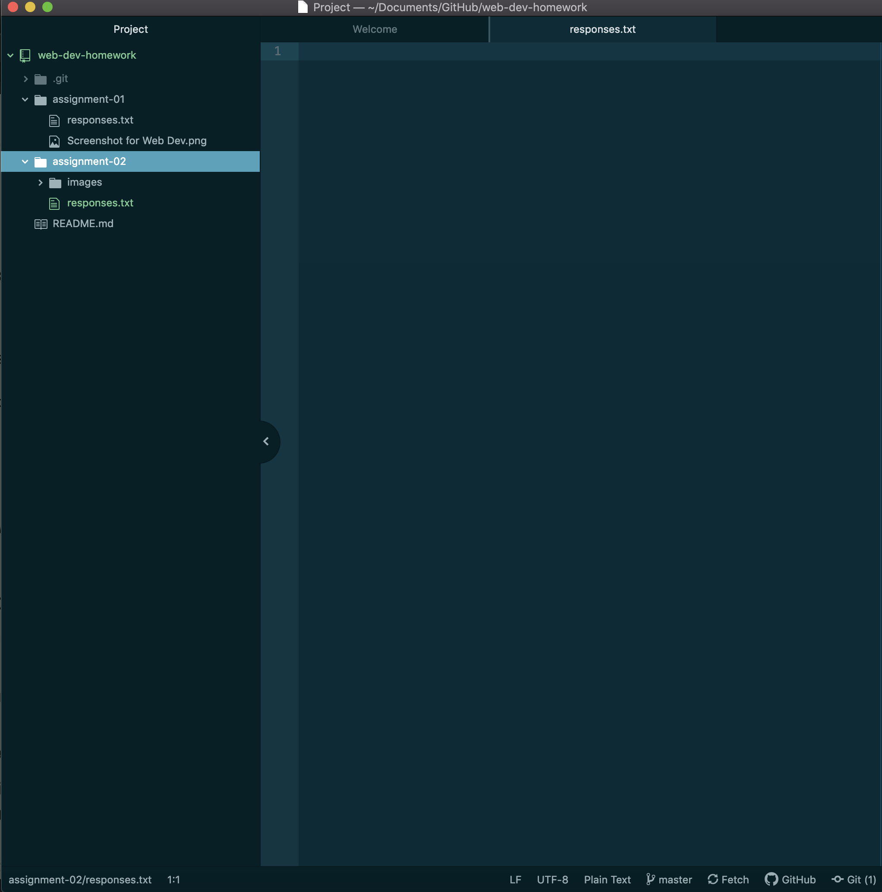

# Assignment 02
## Tennessee Glenn

So far I've learned a lot about the physical makeup of the internet, how data travels over the internet, and what parts make up a URL and why we need them.

I've mainly decided to take this class to fulfill requirements for my minor in media arts, but I am really excited to learn more about the internet and and how to use it because I am wayyy behind for a 27 year old struggling to even comprehend basic things like URLS!

1. I'm excited to learn how to use the things we've been learning about to express myself creatively.

2. I hope to become more knowledgable about the internet and coding in general so I can hold my own in an employment market where these skills are absolutely mandatory.

3. I'm also just generally excited to learn to build a website from scratch!

Website I frequent: [Autostraddle](https://www.autostraddle.com/)

Link to my [responses!](../assignment-02/responses.txt)

