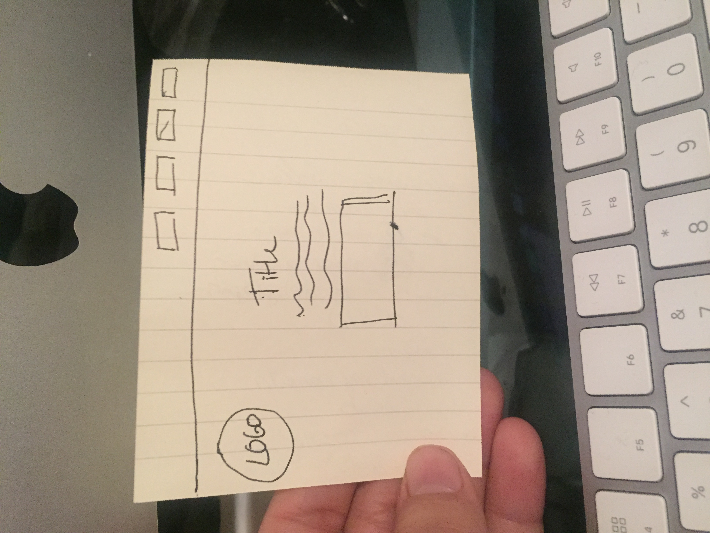

## Assignment 11 README

1. Padding puts space around a particular container while the margin is outside space of the border and a border seperates the edges of different boxes.

2. 

3. I struggled a lot with getting the containers to work, I actually started all  over again. I found a tutorial on youtube with a nav bar I really liked and followed that but I couldn't figure out how to make the rest of my containers work with the nav bar which was sad. Finally I went back to the example on the course website and that all worked together pretty well, I still just feel kind of intimidated when I see a lot of code but breaking it down and focusing on one part at a time was key, 
