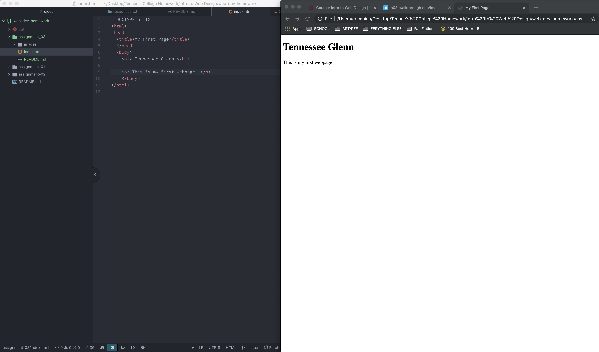

# Tennessee Glenn's README
1. Browsers are like a vehicle that links users into the wider internet. I mainly use Chrome but I remember Internet Exploerer's heyday!
2. A markup language is a type of language which utilizes tags to create different affects. It uses tags which are readable to humans. HTML is a markup language commonly used in development.
3. 
