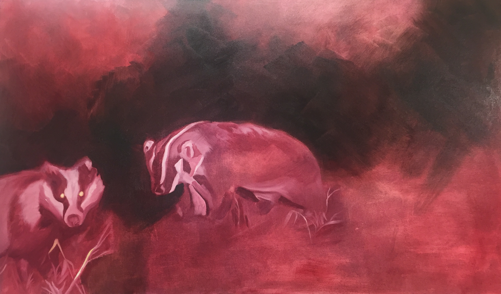

<body>
  

    
  

  /* header image */
  .banner img {
    width: 100%;
    height: auto;
    position: fixed;
  }

  <a href="#">Home</a>

  <a href="#">About</a>

  <a href="#">My Friend Dani</a>

  <a href="#">Contact</a>

  position: fixed;
  top: 0px;
  background-color: lightgreen;
  margin-top: 0;
  height 4em;
  width: 100%;
}
/* sight navigation */
#site-menu, .site-name {
  display: inline-block;
  margin: 1em .2em;
  min-width: 6em;
  text-align: center;
  background-color: orange;
  padding: 0.5em 1em;
}

